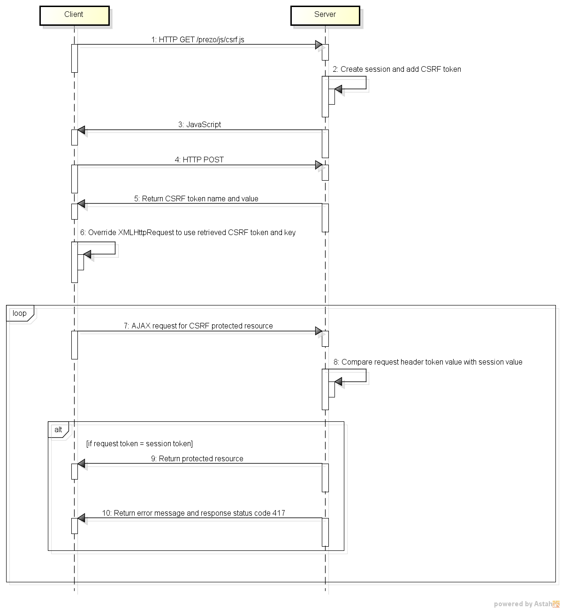

# PrezoServer Implementation for Internet Information Services (IIS)

#### Copyright 2014 Kevin Johnston (kevin@prezoserver.org)

#### This is the design document explaining how the requirements of the [PrezoServer Specification 1.0](https://github.com/prezoserver/prezoserver-docs/blob/master/specification-1.0-draft.md) were implemented for an IIS application server.

## 1.0 Requirements

#### 1.1 Document Root

This requirement was implemented using the "Sites" feature of IIS. A new site is created for each application.
This provides a root document directory that is only for the given application.

#### 1.2 Server Side Includes (SSI)

This requirement was implemented using the "Handler Mappings" feature of IIS.  Module mappings were created for the 
following: 

|Path              |Name               |Handler    |Executable                       |
|------------------|-------------------|-----------|---------------------------------|
|*.html            |ASPClassic-html    |IsapiModule|%windir%\system32\inetsrv\asp.dll|
|/prezo/js/csrf.js |ASPClassic-csrf.js |IsapiModule|%windir%\system32\inetsrv\asp.dll|
|/prezo/js/prezo.js|ASPClassic-prezo.js|IsapiModule|%windir%\system32\inetsrv\asp.dll|

Note that IIS provides a ServerSideIncludeModule handler.  While this handler allows for SSI tags to be processed it 
appears that dynamic files (e.g. ASP files) are not pre-processed before being included and so the code shows up
in the page instead of the dynamically processed content.  Using the IsapiModule solves both problems. SSI includes 
work and dynamic files are pre-processed.

#### 1.3 Directory Structure

The directory and file structure is as follows:

<pre>
/
|-- prezo/
|---- api/
|---- fragments/
|        |-- base.html
|---- js/
|      |-- prezo.js
|      |-- csrf.js
|---- support/
|        |-- api/
|        |-- fragments/
|        |       |-- base.asp (wrapped by base.html)
|        |-- js/
|        |    |-- csrfguard.config.asp (wrapped by csrf.js)
|        |    |-- csrfguard.asp (wrapped by csrf.js)
|        |    |-- prezo.js.asp (wrapped by prezo.js)
|---- config.asp (wrapped by csrf.js and prezo.js)
</pre>  

Preventing client access to /prezo/support/ was implemented using the "Request Filtering" feature of IIS. A deny 
sequence URL filter was added for "prezo/support/". This allows files on the server to access the support directory 
while preventing access from clients.

#### 1.4 base.html

The base.html file was implemented using the SSI wrapper technique to include 2 ASP files which dynamically generate 
the URL for the base href. The file /prezo/support/config.asp is included via SSI to set an ASP variable for 
the document root. The document root is set to "/" when accessing the IIS server directly.  If accessing the IIS server 
through a proxy server then the variable DOCROOT in config.asp is set to the base path used by the proxy server to route
to the IIS server (e.g. http(s)://proxy.server.com[:\<port\>]/\<docroot\> -> http(s)://iis.server.com[:\<port\>]/). 

The file /prezo/support/fragments/base.asp is included so that VB script can dynamically generate the base href 
URL. The base.asp file has logic to detect the presence of an Apache proxy server by checking if the request header 
HTTP_X_FORWARDED_HOST exists. This request header contains the proxy server name and port the client accessed. If this 
request header is not present then it is assumed the client accessed the IIS server directly and it builds the base
href url using the SERVER_NAME and SERVER_PORT request headers. Additionally the protocol (either http 
or https) is determined by checking the HTTPS request header.  If the HTTPS header is set to "On" then the URL is configured to use 
"https://". Otherwise the URL is configured to use "http://".  The document root is appended to the URL as set in 
config.asp. 

#### 1.5 prezo.js

The base.html file was implemented using the SSI wrapper technique to include 2 ASP files which dynamically 
generate the required JavaScript. The file /prezo/support/config.asp is included via SSI to set an ASP variable for 
the document root for the same purpose describe in section 1.4.  The file /prezo/support/js/prezo.js.asp creates the 
JavaScript variable prezo.application.DOCROOT and sets the value to the DOCROOT variable declared in config.asp.

#### 1.6 csrf.js

The [OWASP CSRFGuard Project](https://www.owasp.org/index.php/Category:OWASP_CSRFGuard_Project) for Java was partially 
used to implement this requirement.  The CSRFGuard project has code which dynamically generates a JavaScript file that 
overrides the XMLHttpRequest to inject CSRF tokens.  The project provides a template file (csrfguard.js) which is 
parameterized and is processed by the server to inject appropriate tokens and other configuration into the JavaScript.
This file was taken and converted to /prezo/support/js/csrfguard.js.asp. The configuration options for csrfguard.js.asp 
were placed in the file /prezo/support/js/csrfguard.config.asp. CSRFGuard documentation indicates the purpose of these 
options so it is not covered in this document. Note that the way CSRFGuard manages getting the CSRF token name and value 
into the JavaScript is to make an HTTP POST to the server after the JavaScript file is loaded instead of coding the 
token and value directly into the JavaScript. To support this design an ASP file was created (api/csrf-token.asp) which
manages generation of the CSRF token name and value and setting them on the session. The configuration option 
SERVLET_PATH declared in /prezo/support/js/csrfguard.config.asp is used to set the end point (i.e. api/csrf-token.asp) 
used by the JavaScript to retrieve the CSRF token name and value.

The following sequence diagram is a high level representation of the CSRFGuard protection process:

The following sequence diagram shows how the IIS implementation of PrezoServer uses ASP resources to initialize
CSRFGuard:
